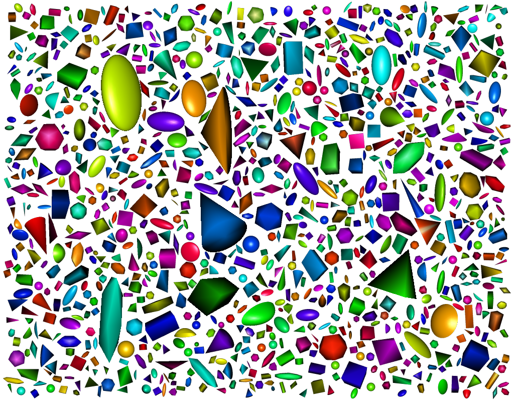
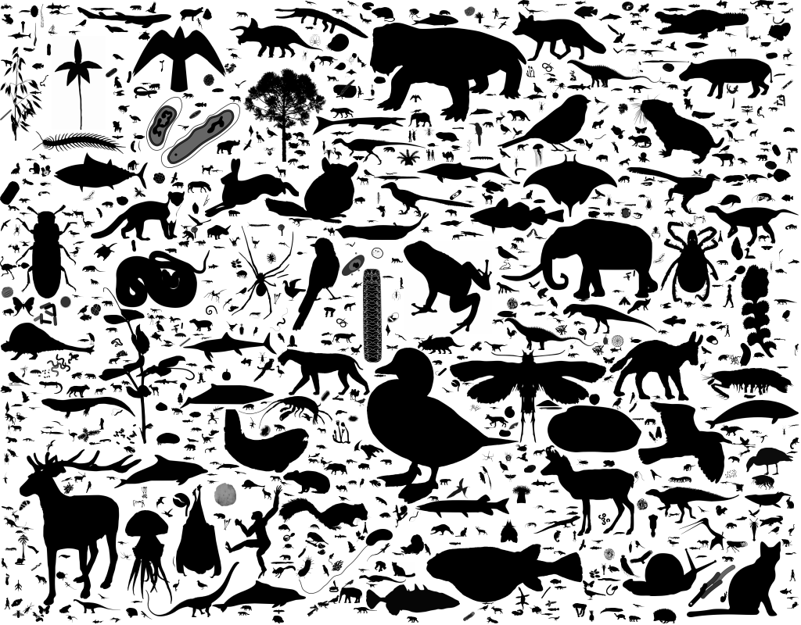

<!-- README.md is generated from README.Rmd. Please edit that file -->

```{r, include = FALSE}
knitr::opts_chunk$set(
  collapse = TRUE,
  comment = "#>",
  fig.path = "man/figures/README-",
  out.width = "100%"
)
```

# impac

<!-- badges: start -->
[](https://lifecycle.r-lib.org/articles/stages.html#experimental)
[](https://github.com/rdinnager/impac/actions)
<!-- badges: end -->

The goal of `{impac}` is to create packed image mosaics. The main function `impac`, takes a set of images, or a function that generates images and packs them into a larger image as tightly as possible, scaling as necessary, using a greedy algorithm (so don't expect it to be fast!). It is inspired by [this python script](https://github.com/qnzhou/Mosaic]). The main upgrade in this package is the ability to feed the algorithm a generator function, which generates an images, as opposed to just a list of pre-existing images (though it can do this too).

## Installation

You can install the development version from [GitHub](https://github.com/) with:

``` r
# install.packages("devtools")
devtools::install_github("rdinnager/impac")
```
## Example

This document and hence the images below are regenerated once a day automatically. No two will ever be alike.

First we load the packages we need for these examples:

```{r load_package}
library(impac)
library(Rvcg)
library(rgl)
library(rphylopic)
```

Next we create an R function to generate an image. In this case, we use the package `rgl` to plot a simple 3d shape, chosen randomly from a set of possibilities:

```{r gen_shapes}

generate_platonic <- function(i, swidth = 200, sheight = 200, cols = rainbow(100)) {
  
  shape <- sample(c("sphere",
                    "spherical_cap",
                    "tetrahedron",
                    "dodecahedron",
                    "octahedron",
                    "icosahedron",
                    "hexahedron",
                    "cube",
                    "cone"),
                  1)
  
  mesh <- switch (shape,
    sphere = Rvcg::vcgSphere(),
    spherical_cap = Rvcg::vcgSphericalCap(),
    tetrahedron = Rvcg::vcgTetrahedron(),
    dodecahedron = Rvcg::vcgDodecahedron(),
    octahedron = Rvcg::vcgOctahedron(),
    icosahedron = Rvcg::vcgIcosahedron(),
    hexahedron = Rvcg::vcgHexahedron(),
    cube = Rvcg::vcgBox(),
    cone = Rvcg::vcgCone(2, 0, 6)
  )
  
  scales <- c(1, 1, 1, 1, 1, 1, 1, 1, 2, 2, 3, 4)
  mesh <- rgl::scale3d(mesh, 
                       sample(scales, 1),
                       sample(scales, 1),
                       sample(scales, 1))
  
  mesh <- rgl::rotate3d(mesh, runif(1, 0, 2 * pi), 0, 0, 1)
  mesh <- rgl::rotate3d(mesh, runif(1, 0, 2 * pi), 0, 1, 0)
  mesh <- rgl::rotate3d(mesh, runif(1, 0, 2 * pi), 1, 0, 0)
  
  rgl::shade3d(mesh, col = sample(cols, 1),
               specular = "grey")
  
  png_file <- tempfile(fileext = ".png")
  rgl::snapshot3d(filename = png_file, width = swidth, height = sheight,
                  webshot = FALSE)
  rgl::close3d()
  
  im2 <- imager::load.image(png_file)
  im <- imager::imfill(swidth, sheight, val = c(0, 0, 0, 1))
  im[ , , , 1:3] <- im2 
  im[imager::R(im) == 1 & imager::G(im) == 1 & imager::B(im) == 1] <- 0
  
  im  
 
}

```

Now we feed our function to the `impac()` function, which packs the generated images onto a canvas: 

```{r make_platonic, out.width='85%'}
shapes <- impac(generate_platonic, progress = FALSE, show_every = 0, bg = "white")
imager::save.image(shapes$image, "man/figures/R_gems.png")
```



Now let's pack some Phylopic images! These are silhouettes of organisms from the [Phylopic](http://phylopic.org/) project. We will use the `rphylopic` package to grab a random Phylopic image for packing:

```{r get_phylopic}
all_images <- rphylopic::get_uuid(n = 10000)
get_phylopic <- function(i, max_size = 400, isize = 1024) {
  fail <- TRUE
  while(fail) {
    uuid <- sample(all_images, 1)
    pp <- try(rphylopic::get_phylopic(uuid, isize), silent = TRUE)
    if(!inherits(pp, "try-error")) {
      fail <- FALSE
    }
  }
  rot <- aperm(pp, c(2, 1, 3))
  dims <- dim(rot)
  im <- imager::as.cimg(as.vector(rot), dim = c(dims[1], dims[2], 1, dims[3]))
  max_dim <- which.max(dims[1:2])
  other_dim <- (max_size / dims[max_dim]) * dims[1:2][-max_dim]
  new_size <- c(0, 0)
  new_size[max_dim] <- max_size
  new_size[-max_dim] <- other_dim
  im <- imager::resize(im, new_size[1], new_size[2], interpolation_type = 6)
  im <- imager::imchange(im, ~ . < 0, ~ 0)
  im <- imager::imchange(im, ~ . > 1, ~ 1)
  ## this adds custom metadata
  list(im, uuid = uuid)
}
```

Now we run `impac` on our phylopic generating function:

```{r mosaic_phylopic, out.width='85%'}
phylopics <- impac(get_phylopic, progress = FALSE, show_every = 0, bg = "white", min_scale = 0.01)
imager::save.image(phylopics$image, "man/figures/phylopic_a_pack.png")
```



Now we extract the artists who made the above images using the uid of image.

```{r get_artist}
image_dat <- lapply(phylopics$meta$uuid, 
                    function(x) {Sys.sleep(2); rphylopic::get_attribution(x)$contributor})
```

```{r post_tweet, echo=FALSE, results='hide'}
post_tweet <- Sys.getenv("POST_TWEET")==1
```

```{r print_credit, echo=FALSE, comment="", results='asis', eval=post_tweet}
image_dat <- unlist(lapply(image_dat, function(x) ifelse(is.null(x), NA, x)))
cat("## Artists whose work is showcased:\n")
cat(paste(na.omit(unique(image_dat)), collapse = ", "))
cat("\n\n## Detailed credit:\n")
```

```{r tab, echo=FALSE, eval=post_tweet}
knitr::kable(data.frame(num = seq_along(image_dat), 
                        x = phylopics$meta$x, 
                        y = phylopics$meta$y, 
                        artist = image_dat),
             col.names = c("", "Image X Coord", "Image Y Coord", "Credit"))
```

```{r send_tweet, echo=FALSE, results='hide', eval=post_tweet}
auth <- rtweet::rtweet_bot(api_key = Sys.getenv("TWITTER_APP_KEY"),
                           api_secret = Sys.getenv("TWITTER_APP_SECRET"),
                           access_token = Sys.getenv("TWITTER_APP_TOKEN"),
                           access_secret = Sys.getenv("TWITTER_APP_TOKEN_SECRET"))
rtweet::auth_as(auth)
rtweet::post_tweet("A packed image mosaic of @PhyloPic images generated with the {impac} package (https://github.com/rdinnager/impac). If you like this image please visit http://phylopic.org/ to check out more images and consider supporting them with a donation. Artists showcased: https://github.com/rdinnager/impac#artists-whose-work-is-showcased", 
                   media = "man/figures/phylopic_a_pack.png",
                   media_alt_text = "A packed image mosaic of PhyloPic images (animal and plant silhouettes) generated with the {impac} package")
```
